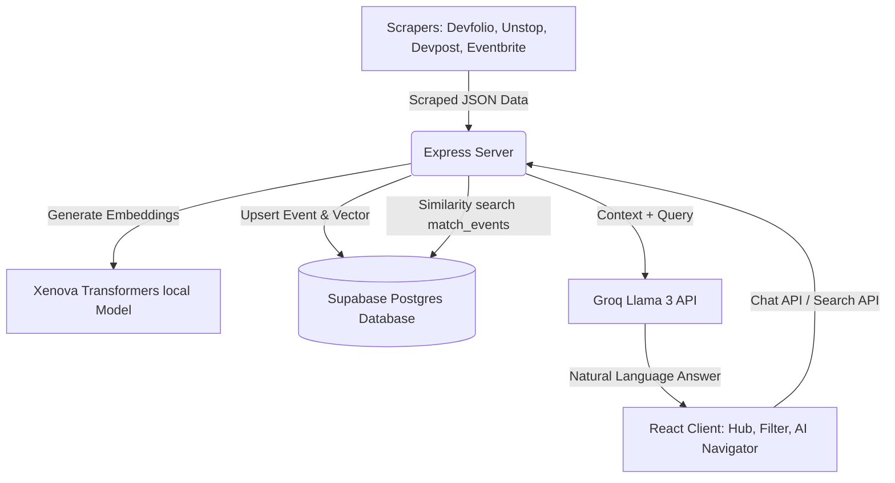

# UniStop Project Wiki

Welcome to the UniStop Project Wiki. This documentation serves as the single source of truth for coding agents and developers to understand the project architecture, data models, and system flows.

---

## 1. System Architecture Overview

UniStop is a premium web aggregator for hackathons and coding events. It automatically scrapes events from major portals, saves them to a relational database, generates high-quality semantic vector embeddings, and provides a RAG (Retrieval-Augmented Generation) chatbot for natural language discovery.

---

## 2. Directory Structure

- **[client/](file:///c:/Code/Unistop/client)**: React.js SPA frontend.
  - **[client/src/components/](file:///c:/Code/Unistop/client/src/components)**: Common components (Navbar, EventCard).
  - **[client/src/pages/](file:///c:/Code/Unistop/client/src/pages)**: Application pages:
    - `Hub`: Landing dashboard showing featured/trending categories.
    - `Filter`: The Filter Lab search page with advanced filters sidebar drawer.
    - `AINavigator`: A conversational full-page chatbot interface.
    - `Landing`: Authenticated entry point (magic link entry).
    - `Saved`: Bookmarked events collection.
  - **[client/src/App.css](file:///c:/Code/Unistop/client/src/App.css)**: Core Indigo Horizon styling tokens (CSS variables on `:root`).
- **[server/](file:///c:/Code/Unistop/server)**: Express.js backend.
  - **[server/scrappers/](file:///c:/Code/Unistop/server/scrappers)**: TinyFish browser automation script scrapers.
  - **[server/services/](file:///c:/Code/Unistop/server/services)**: Core services (local Xenova embedding generator).
  - **[server/controllers/](file:///c:/Code/Unistop/server/controllers)**: Event and chat routers logic.
  - **[server/routes/](file:///c:/Code/Unistop/server/routes)**: HTTP routes mapping.

---

## 3. Reference Documentation

- [Development Logs](file:///c:/Code/Unistop/wiki/log.md)
- [System Concepts: RAG & Embeddings](file:///c:/Code/Unistop/wiki/concepts/rag_pipeline.md)
- [System Concepts: TinyFish Scrapers](file:///c:/Code/Unistop/wiki/concepts/web_scrapers.md)
- [Database Schema & Entities Directory](file:///c:/Code/Unistop/wiki/entities/directory.md)
